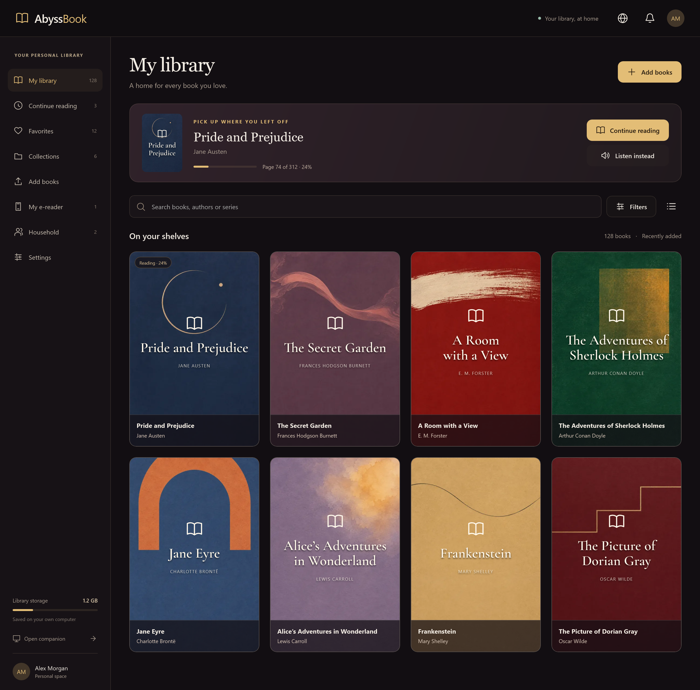
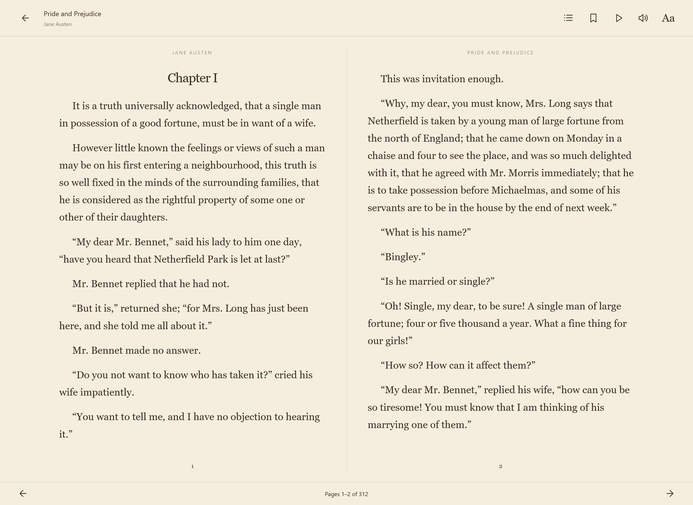
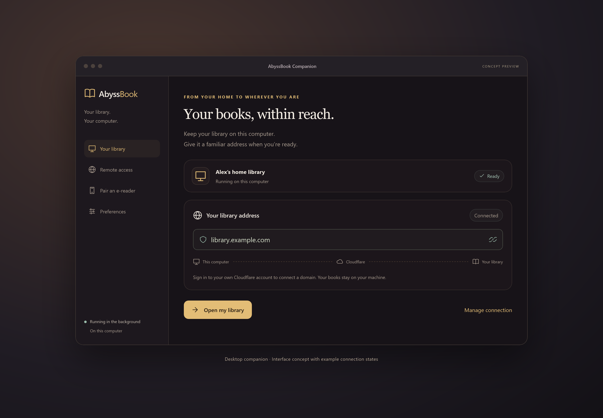

# AbyssBook — personal library showcase

**Your books. Your space. Your server.**

AbyssBook is a self-hosted personal-library project concept: a welcoming home for your own ebooks, designed to run on a private server or a home computer. Bring your books, organize your shelves, read or listen, and take selected titles with you on a paired e-reader.

This folder contains an **English presentation prototype and 16 screenshots**, prepared for the project website. The interface, sample library, descriptions and reading excerpts are all in English.

## Status and intended experience

These are rendered HTML/CSS interface simulations, **not screenshots of a released self-hosted application**. They present the intended experience:

- Add several EPUB or FB2 files together, with covers, authors and descriptions drawn from the books; recognize updated editions.
- Arrange a personal library into collections, keep favorites and return to recently read books.
- Read in a distraction-free phone layout or a two-page tablet/desktop layout, with day and night themes.
- Keep reading position separate from bookmarks, and listen with narration controls that do not squeeze the reading page.
- Give each household member a personal account, shelves, reading progress and paired devices.
- Manage the contents of an e-reader shelf; apply changes when the reader's Sync action is used.
- Choose an interface language independently of a book's language.
- Use a simple companion to help run a library at home, connect a domain through the owner's Cloudflare account, and pair a physical reader with an account.

The companion screens are additionally marked **CONCEPT PREVIEW** in the images. Domain, USB, Wi-Fi, storage, account, sync and import states are examples. No real account, domain or device was changed to make these screenshots.

The prototype supports navigation, a small sample-title search, and explanatory controls. Authentication, importing, file downloads, persistent collections/bookmarks, actual pagination, translations, speech generation, remote access and physical-device synchronization are **not implemented here**. The sample voice “Oliver” is a presentation label, not a promise of an installed voice. Book counts, page counts and progress are illustrative; screenshots show separate example states, not a continuous recorded session.

## Website-ready images

All PNGs are rendered at **2× pixel density**. Use them with their aspect ratio preserved. [manifest.json](screenshots/manifest.json) records each route, CSS viewport, caption and simulation status.

| Screenshot | What it shows |
| --- | --- |
| [01 · Personal library](screenshots/01-library-desktop.png) | Covers, continue reading, search, filters and navigation |
| [02 · Book details](screenshots/02-book-details.png) | Synopsis, progress, reading/listening, download and device actions |
| [03 · Add books](screenshots/03-add-books.png) | Batch upload and metadata preview |
| [04 · Collections](screenshots/04-collections.png) | Personal themed shelves |
| [05 · Two-page reader](screenshots/05-reader-spread.png) | Light reading layout with a slim bottom bar |
| [06 · Narration](screenshots/06-reader-audio.png) | Night reading, highlighted paragraph and floating voice controls |
| [07 · Bookmarks](screenshots/07-bookmarks.png) | Named bookmarks independent of last position |
| [08 · My e-reader](screenshots/08-device-shelf.png) | Account pairing and a managed device shelf |
| [09 · Household](screenshots/09-household.png) | Separate personal accounts |
| [10 · Preferences](screenshots/10-settings-languages.png) | Proposed languages, reading and narration settings |
| [11 · Companion / domain](screenshots/11-companion-domain-concept.png) | **Concept:** home hosting and remote-access setup |
| [12 · Companion / pairing](screenshots/12-companion-pairing-concept.png) | **Concept:** account and Wi-Fi pairing workflow |
| [13 · Portrait tablet](screenshots/13-library-ipad-portrait.png) | Persistent sidebar and three-column shelf |
| [14 · Phone library](screenshots/14-library-phone.png) | Compact two-column library |
| [15 · Phone reader](screenshots/15-reader-phone.png) | Single-page English reading |
| [16 · Sign-in](screenshots/16-sign-in.png) | Personal-library welcome and login |

### Preview







## Preview and regenerate

The demo has no build step or network dependencies. Open `demo/index.html` locally, or serve it with Node.js:

```sh
node capture.cjs --serve
```

Open `http://127.0.0.1:8876`. For example, `?view=reader`, `?view=audio`, `?view=upload`, `?view=pairing`.

To regenerate the PNGs, install Playwright in a temporary tool directory, install its WebKit browser and point `PLAYWRIGHT_MODULE` at the installed module (or make `playwright` available to Node's module resolution). Then run:

```sh
node capture.cjs
```

The capture script serves this demo on loopback only, waits for fonts, checks JavaScript errors, horizontal overflow and accidental Cyrillic UI text, tests sample-title search, and writes the images and manifest. It does not contact a live library. PNGs were visually checked at desktop, portrait-tablet and phone dimensions; this is layout QA, not a physical iPad/iPhone or backend acceptance test.

## Assets and content

- Eight English-language classics are used as sample titles. The reader contains a short excerpt from Jane Austen's original *Pride and Prejudice* (1813), not a modern translation.
- Abstract cover backgrounds are reused from the owner's existing library artwork. Titles and authors are rendered in HTML; these are designed placeholders, not publisher covers.
- Cormorant Garamond is bundled with its [SIL Open Font License](demo/assets/fonts/OFL-CormorantGaramond.txt).
- Account names, email addresses, the example domain and all operational states are fictional.
- Existing hardware manufacturing files elsewhere in `AbyssBook/` are unchanged.
