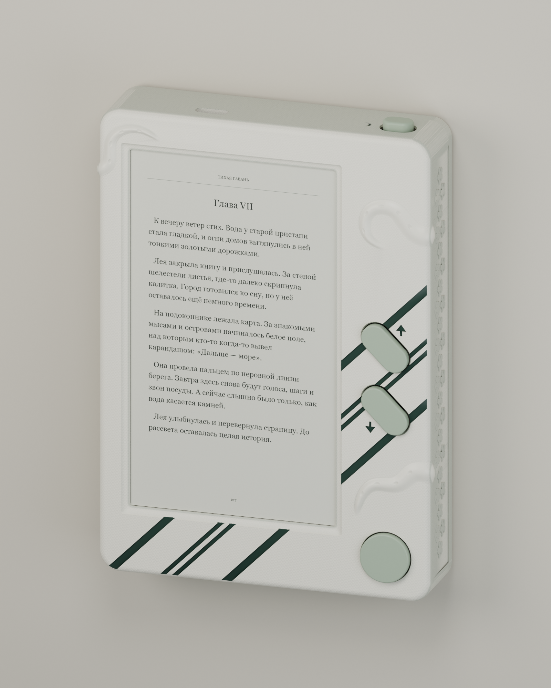
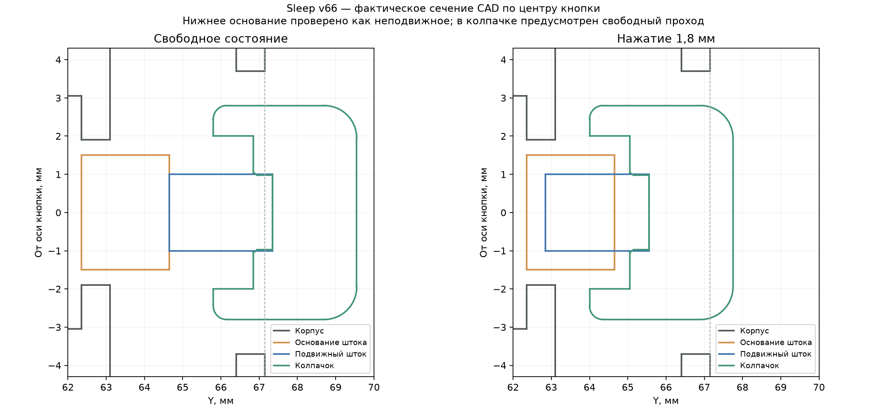

# OctoFox Book / OctoFox Library

OctoFox Book is the e-ink device. OctoFox Library is the personal library software presented alongside it. The library screenshots below are interface prototypes. Historical model filenames remain unchanged for version traceability.

## OctoFox Library — English showcase

[Скриншоты и описание OctoFox Book](showcase/README.md): англоязычный презентационный прототип личной self-hosted библиотеки — загрузка своих книг, коллекции, читалка, озвучка, аккаунты и управление полкой устройства. В наборе 16 PNG для компьютера, iPad и телефона, а также исходники интерактивной демонстрации.

Приложение-компаньон для домашнего сервера, подключения домена и привязки читалки показано как **концепт**, а не готовый продукт. Библиотека и данные на скриншотах демонстрационные. Производственные файлы корпуса ниже сохранены без изменений.

## Корпус электронной читалки

[Фотографии живого прототипа](showcase/prototype-photos/README.md) — семь оригинальных снимков сборки, корпуса, кнопок и USB-C, с английскими подписями для страницы проекта.

Корпус электронной читалки на LILYGO Screen-4.7-S3 V2.4. Прошивка прототипа пока не опубликована; этот репозиторий содержит материалы по корпусу и электронике, а не публичный выпуск прошивки.

Состав электроники, количество компонентов, распиновка и сведения об устройстве —
[ELECTRONICS.md](ELECTRONICS.md). Там также отмечено расхождение между выбранным
Sleep self-lock и обработкой POWER в текущей прошивке прототипа.

Актуальный комплект: **передняя панель и колпачок Sleep v66**, остальные **пять деталей v65**. Это один совместимый набор из семи деталей. Единицы — миллиметры; общего масштабирования нет.



## Окрашенная 3D-сцена

В [visualization](visualization/) собрана актуальная модель с молочным корпусом, тёмными хвойными полосами, шалфейными кнопками и книжной страницей на экране.

- [Blender](visualization/AbyssBook.blend) — редактируемые детали, материалы, встроенные текстуры, свет и три камеры.
- [GLB](visualization/AbyssBook.glb) — модель с материалами и текстурами для 3D-просмотрщиков.
- Рендеры: [спереди](visualization/AbyssBook_front.png), [сзади](visualization/AbyssBook_back.png), [прямой вид](visualization/AbyssBook_front_straight.png).
- [Описание сцены и пересборка](visualization/README_RU.md).

Макрогеометрия соответствует текущему комплекту v66 + v65. Мелкая чешуя в сцене представлена картой рельефа. Это вариант окраски; производственные STEP и STL сохранены. BLEND, GLB и данные сеток NPZ хранятся через Git LFS.

## Скачать и печатать

Большие STL хранятся через **Git LFS**. Обычный ZIP исходников GitHub может содержать указатели вместо моделей. Надёжный способ получить комплект:

```sh
git lfs install
git clone https://github.com/EriArk/hardware-stuff.git
cd hardware-stuff
git lfs pull
```

Печатать по одному экземпляру каждого файла из [STL/print-set](STL/print-set/). Там ровно семь деталей, без дублирующих вариантов и без поддержек. Ориентацию и поддержки подготовить в слайсере. Комплект рассчитан на фотополимерную печать; рабочий принтер — Photon Mono, смола ABS-like.

| Деталь | Редакция | Назначение |
| --- | --- | --- |
| `front` | v66 | Передняя панель с тентаклями, микрочешуёй и исправленным окном Sleep |
| `back` | v65 | Задняя крышка с хватом, микрочешуёй и углублённым логотипом |
| `up_switch_cover` | v65 | Внутренний держатель свича UP |
| `down_switch_cover` | v65 | Внутренний держатель свича DOWN |
| `ok_switch_cover` | v65 | Внутренний держатель свича OK |
| `power_switch_cover` | v65 | Внутренний держатель свича Sleep |
| `sleep_button_cap` | v66 | Наружный овальный колпачок Sleep |

Названия файлов сохранены, чтобы их можно было сопоставить с предыдущими печатными версиями. Наружные UP/DOWN и круглая OK остаются покупными и в набор печатных деталей не входят.

## Структура

| Папка | Содержимое |
| --- | --- |
| [STEP/parts](STEP/parts/) | Семь отдельных редактируемых CAD-деталей |
| [STEP/assembly](STEP/assembly/) | Актуальная сборка v66 + v65 для просмотра |
| [STL/print-set](STL/print-set/) | Семь окончательных деталей для печати |
| [source](source/) | Скрипты рельефа, узла Sleep и пробников чешуи; геометрическая основа и референсы |
| [docs](docs/) | Крепёж, параметры и отчёты проверок |
| [previews](previews/) | Виды и сечение Sleep |
| [visualization](visualization/) | Окрашенная сборка BLEND/GLB, текстуры и студийные рендеры |

Микрочешуя присутствует в STL. STEP содержит гладкую CAD-основу, крупный рельеф, гравировку и всю механику. Параметры чешуи: шаг 0,8 мм, высота до 0,10 мм. Высота тентаклей — около 0,9 мм.

В сборке задняя крышка перенесена на +18 мм по Z; отдельная деталь сохраняет свою исходную систему координат. Сборка STEP предназначена для просмотра, а не для печати одним куском.

## Механика и крепёж

- UP/DOWN: свичи 8,5 × 8,5 мм. OK: круглая центральная кнопка D-pad Ø14,3 мм.
- Sleep: свич 5,8 × 5,8 мм с фиксацией, полный ход 1,8 мм. Верхушка штока 2,5 × 2,0 мм; широкое основание 3,8 × 3,0 мм.
- Держатели свичей: по два винта M2 × 6, всего восемь. Задняя крышка: четыре M2,5 × 8, ближе к углам.
- Резьба не моделировалась. Гладкие каналы Ø1,6 и Ø2,05 предназначены под нарезание метчиком; запас глубины за концом винта — 1,5 мм.
- Расчёт головок: для M2 цилиндрическая Ø3,8 × 2,0 мм; для M2,5 — Ø4,5 × 2,5 мм. Сверить с используемыми винтами. Координаты, опоры и глубины — [fasteners.json](docs/fasteners.json).
- Вырез USB-C сдвинут на 1,5 мм к передней панели. Бортик экрана усилен; положение кнопок и хват задней крышки сохранены.

### Исправление Sleep v66

Окно — 10,6 × 7,4 мм, колпачок — 8,8 × 5,6 мм. Внутри отдельная полость под широкое основание и посадка на верхушку штока с четырьмя короткими округлыми рёбрами. Номинальный натяг на рёбрах — 0,025 мм на сторону; торец штока задаёт глубину установки. При полном ходе нажимная поверхность остаётся выше корпуса на 0,6 мм.



Колпачок надевается снаружи после установки свича и внутреннего держателя. Сторона штока 2,5 мм направлена вдоль длинной оси колпачка. Посадочные поверхности гнезда и проходного окна оставить без краски.

## Проверки и статус

Статус — тестовая печать. Программно проверены валидность CAD/STEP, совместимость деталей, замкнутость и связность STL. Для Sleep проверены положения по ходу 0–1,8 мм с шагом 0,1 мм, наклоны до 6° в восьми направлениях и поперечное смещение свича ±0,15 мм: пересечений нет. Минимальный зазор в проверенных состояниях — около 0,161 мм. Дополнительно проверен прямой ход до 2,0 мм.

Отчёты находятся в [docs/verification](docs/verification/): базовая CAD-редакция v65, локальное исправление v66 и итоговый набор STL. У фактурной панели проверка самопересечений включает полную проверку исходной сетки и проверки всех потенциально пересекающихся соседей локально изменённых участков. Силу удержания колпачка и работу резьбы нужно подтвердить на реальных печатных деталях. Объёмных моделей платы, экрана, аккумулятора и проводов в исходных STEP нет, поэтому их пересечения с крепежом не проверены.

Список актуальных деталей — [parts.json](parts.json). Проверка контрольных сумм файлов после скачивания:

```sh
python source/verify_files.py
```

Инструкции по исходникам — [source/README.md](source/README.md).
