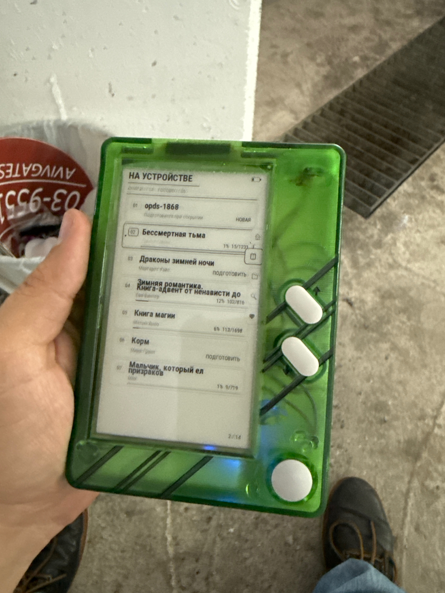
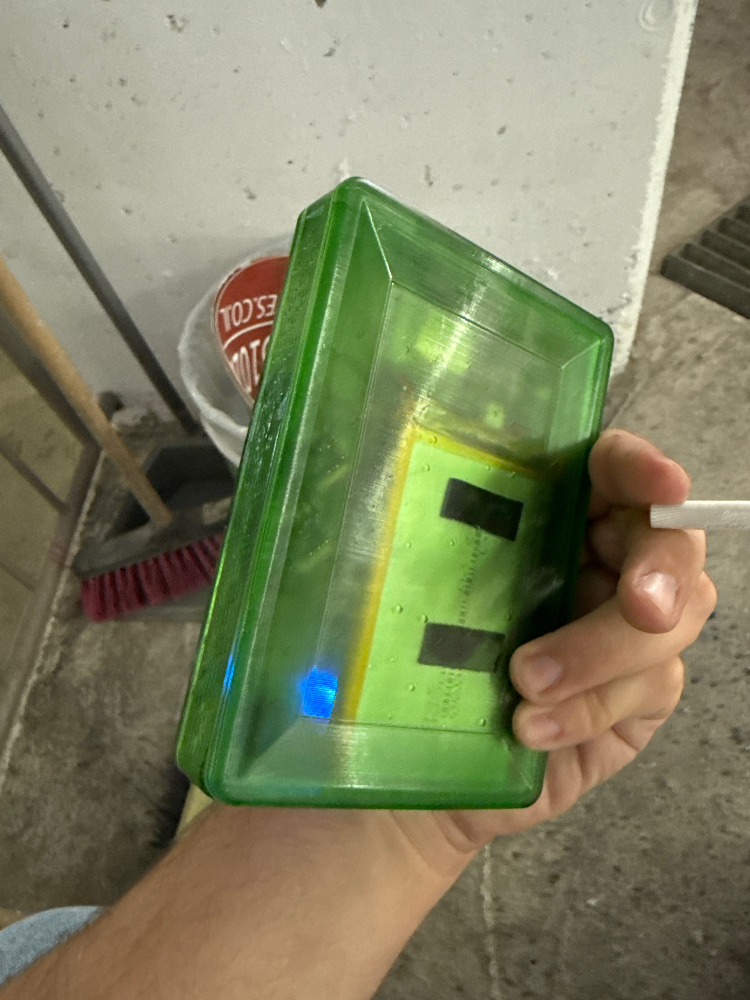
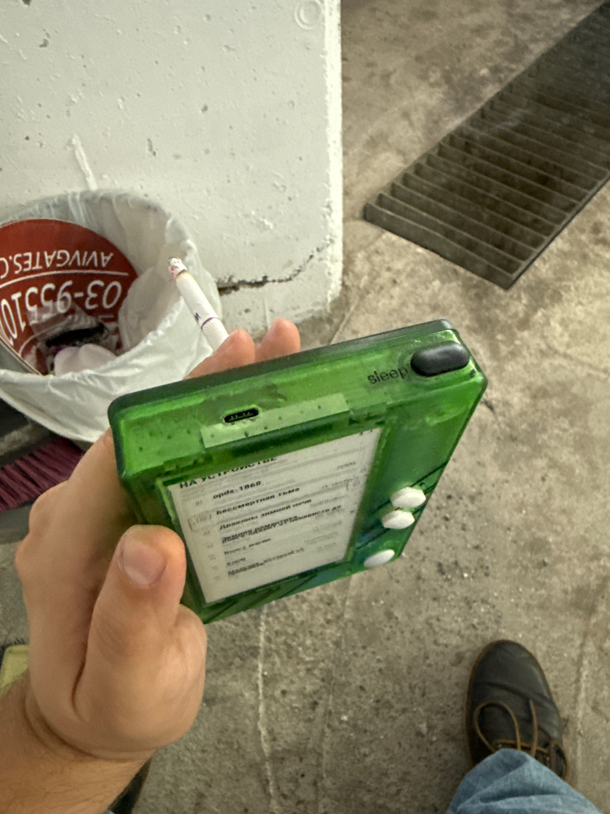
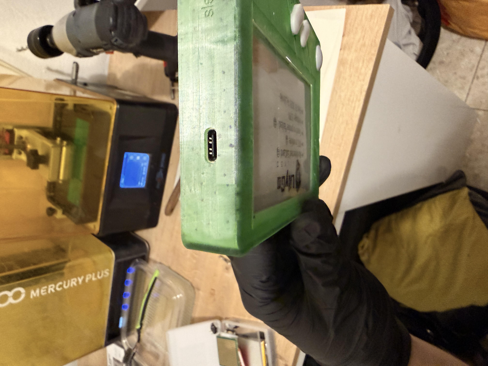
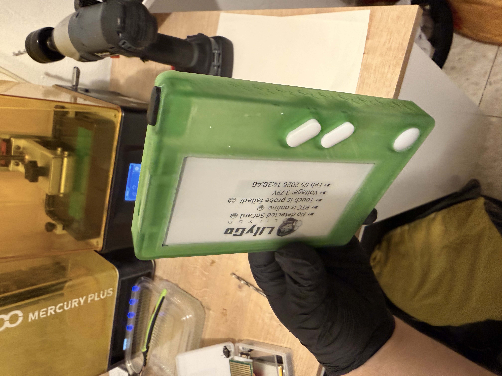
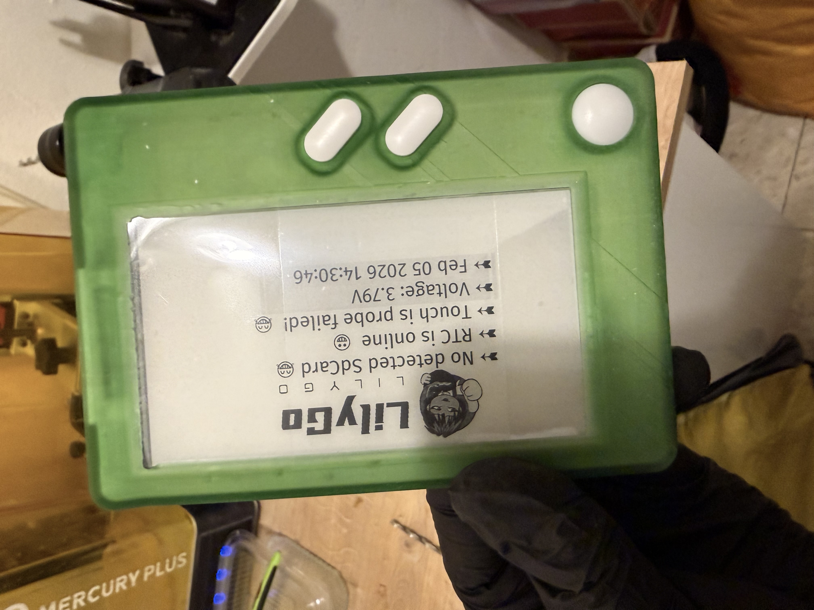
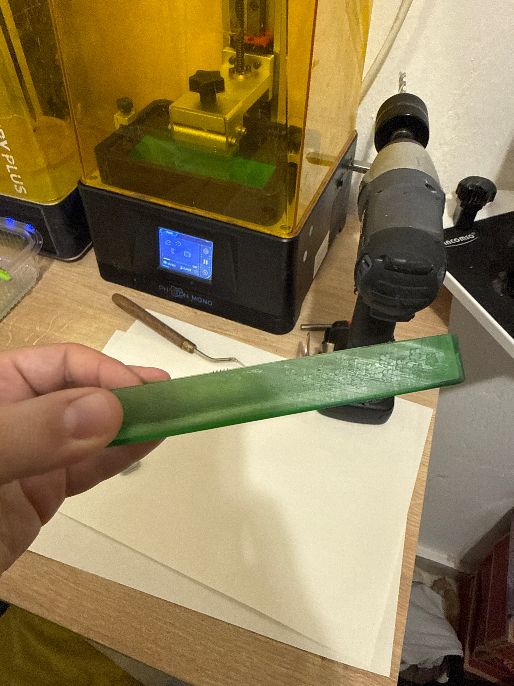

# OctoFox Book — physical prototype

Seven original photographs supplied by the maker, documenting the hands-on build of the OctoFox Book e-reader: the translucent green enclosure, physical controls, USB-C opening and workshop fit checks.

These are **real prototype photographs**, separate from the simulated website and companion screens in the [software showcase](../README.md). They show work in progress, including an earlier diagnostic screen and the existing Russian-language reader interface. They are not photographs of the proposed English software release, and do not establish a specific enclosure revision or final production finish.

The JPEGs are preserved at their supplied resolution, without cropping, retouching or replacing screen content. Original filenames are retained.

## Assembled prototype

### Front and physical controls

### Translucent rear enclosure

### Top edge, USB-C and Sleep button

## Workshop build

### USB-C opening detail

### Angled assembly view

### Front fit check

### Side profile

