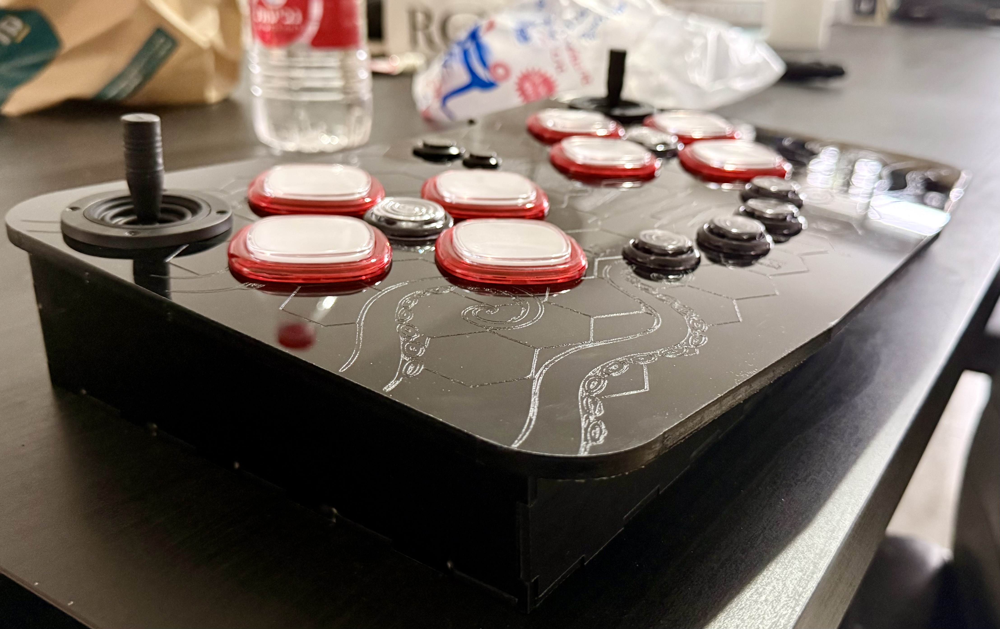
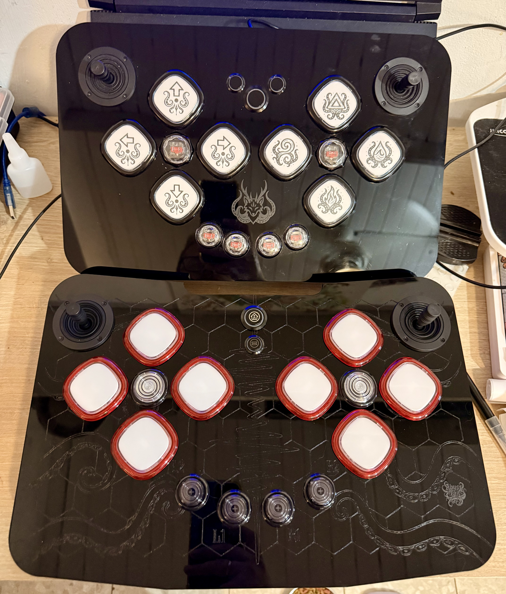

# OctoFox Controller

DIY-контроллер для ритм-игр на **Raspberry Pi Pico**, с крупными аркадными
кнопками и двумя джойстиками. Кнопки и джойстики — легкодоступные компоненты
с AliExpress.

**Статус: прототипы.** Подробная документация и чертежи будут добавлены позже.
Сейчас здесь собраны фотографии и графические материалы проекта.

## Конструкция

- Плата управления — Raspberry Pi Pico.
- Кнопки и джойстики — покупные; точные модели пока не зафиксированы.
- Корпус и оформление — собственные, с тентаклями, символами и знаком AbyssTail.
- На фотографиях показаны два варианта прототипа.

## Материалы

| Папка | Содержимое |
| --- | --- |
| [photos](photos/) | Фотографии прототипов |
| [artwork](artwork/) | Эскизы символов для оформления |

Графика: [набор символов](artwork/button-symbols.png),
[треугольный символ](artwork/triangle-symbol.png).

## Позже

Документация по сборке, точный список компонентов, схема подключения
и чертежи корпуса. Текущие фотографии и эскизы фиксируют состояние
прототипов; готовый комплект для самостоятельной сборки ещё не опубликован.
